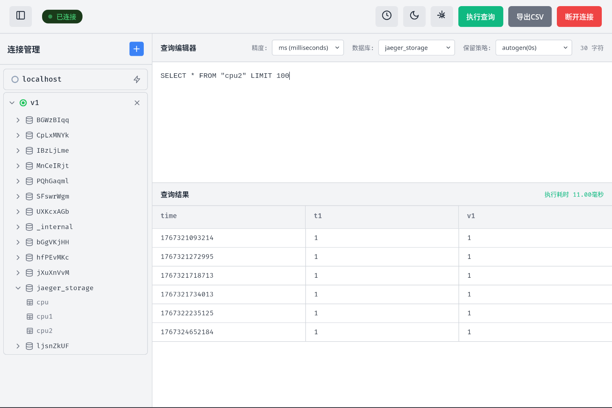

# openGemini Studio

<p align="center">
  <a href="README.md">English</a> | <a href="README_zh-CN.md">简体中文</a>
</p>

<p align="center">
  
  
  
  
</p>

一个现代化的 [openGemini](https://github.com/openGemini/openGemini) 时序数据库跨平台桌面客户端。基于 Wails、Vue 3 和 TypeScript 构建，为数据库管理、查询执行和数据可视化提供原生桌面体验。

## 📋 目录

- [功能特性](#-功能特性)
- [截图展示](#-截图展示)
- [快速开始](#-快速开始)
  - [前置要求](#前置要求)
  - [安装](#安装)
- [使用指南](#-使用指南)
- [从源码构建](#-从源码构建)
- [开发](#-开发)
- [架构](#-架构)
- [贡献](#-贡献)
- [许可证](#-许可证)
- [社区](#-社区)
- [致谢](#-致谢)

## ✨ 功能特性

### 核心功能
- **多连接管理**：同时连接多个 openGemini 实例，支持 HTTP/HTTPS 协议
- **SQL 查询编辑器**：高级 InfluxQL 查询编辑器，支持语法高亮和自动补全
- **查询执行**：实时显示查询结果和性能指标
- **数据可视化**：在可自定义的表格中查看查询结果，支持列宽调整
- **查询历史**：持久化查询历史记录，跟踪成功/失败状态和执行时间

### 数据库操作
- **数据库浏览器**：以树形视图浏览数据库、测量值、保留策略和字段
- **元数据管理**：查看和管理数据库元数据，包括保留策略
- **数据写入**：支持使用行协议的 INSERT 操作
- **批量操作**：按顺序执行多个查询

### 用户体验
- **跨平台**：支持 Windows、macOS 和 Linux 的原生桌面应用程序
- **国际化**：内置支持英语和简体中文
- **主题支持**：浅色、深色和跟随系统主题模式
- **可自定义**：可配置字体、历史记录限制和数据目录
- **调试模式**：可选的调试模式，用于详细日志记录和诊断

### 安全与连接
- **TLS/SSL 支持**：支持自定义 CA 证书的安全连接
- **证书管理**：支持客户端证书和密钥
- **身份认证**：用户名/密码认证
- **灵活配置**：每个连接独立的安全设置

## 📸 截图展示



## 🚀 快速开始

### 前置要求

**普通用户：**
- 无需额外依赖 - 直接下载并运行适用于您平台的预构建二进制文件

**开发者：**
- Go 1.24 或更高版本
- Node.js 16 或更高版本
- npm 或 yarn
- Wails CLI v2

### 安装

#### 下载预构建二进制文件

从 [Releases](https://github.com/openGemini/openGemini-studio/releases) 页面下载适用于您平台的最新版本：

- **Windows**：`openGemini-studio-windows-amd64.exe`
- **macOS**：`openGemini-studio-darwin-universal`
- **Linux**：`openGemini-studio-linux-amd64`

#### 从源码安装

```bash
# 克隆仓库
git clone https://github.com/openGemini/openGemini-studio.git
cd openGemini-studio

# 安装 Wails CLI（如果尚未安装）
go install github.com/wailsapp/wails/v2/cmd/wails@latest

# 安装依赖并构建
wails build
```

## 💡 使用指南

### 创建连接

1. 启动 openGemini Studio
2. 点击侧边栏中的"添加连接"按钮
3. 输入连接详情：
   - **连接名称**：连接的友好名称
   - **地址**：openGemini 服务器地址（例如：`localhost:8086`）
   - **协议**：HTTP 或 HTTPS
   - **认证**：如需要，启用并提供凭据
4. 点击"测试连接"进行验证
5. 点击"保存连接"进行持久化

### 执行查询

1. 从连接树中选择一个数据库
2. 在编辑器中输入您的 InfluxQL 查询
3. 点击"执行查询"或按 `Ctrl+Enter`（Windows/Linux）或 `Cmd+Enter`（macOS）
4. 在下方的表格中查看结果

### 管理查询历史

- 点击"查询历史"按钮查看过去的查询
- 点击历史记录项将其追加到当前查询编辑器
- 使用"清空历史"按钮清除历史记录

### 配置设置

通过齿轮图标访问设置：
- **语言**：在英语和中文之间切换
- **主题**：选择浅色、深色或系统主题
- **自定义字体**：设置自定义字体系列
- **最大历史记录数**：配置要保留的查询数量（10-500）
- **调试模式**：启用详细日志记录以进行故障排除

## 🔨 从源码构建

### 前置要求

安装以下依赖：

```bash
# 安装 Wails CLI
go install github.com/wailsapp/wails/v2/cmd/wails@latest

# 验证安装
wails doctor
```

### 构建命令

```bash
# 开发构建
wails build

# 带优化的生产构建
wails build -clean

# 为特定平台构建
wails build -platform windows/amd64
wails build -platform darwin/universal
wails build -platform linux/amd64
```

### 输出

构建的二进制文件将放置在 `build/bin/` 目录中。

## 🛠 开发

### 以开发模式运行

```bash
# 启动带热重载的开发服务器
wails dev
```

这将运行一个带有热模块替换的 Vite 开发服务器。当您修改前端代码时，应用程序将自动重新加载。后端更改需要重启。

### 项目结构

```
openGemini-studio/
├── app.go                  # 主应用程序逻辑
├── data_struct.go          # 数据模型和结构
├── http_client.go          # OpenGemini HTTP 客户端
├── database.go             # BoltDB 持久化层
├── logger.go               # 日志基础设施
├── frontend/               # Vue.js 前端
│   ├── src/
│   │   ├── components/     # Vue 组件
│   │   ├── composables/    # Vue 组合式函数
│   │   ├── locales/        # i18n 翻译
│   │   └── types/          # TypeScript 类型
│   └── wailsjs/            # 生成的 Wails 绑定
└── build/                  # 构建输出目录
```

### 前端开发

```bash
cd frontend

# 安装依赖
npm install

# 运行 Vite 开发服务器
npm run dev

# 构建前端
npm run build

# 类型检查
npm run type-check
```

### 后端开发

后端使用 Go 编写，使用：
- **Wails v2**：桌面应用程序框架
- **BoltDB**：用于配置存储的嵌入式数据库
- **openGemini Go Client**：官方 openGemini 客户端库

## 🏗 架构

### 技术栈

**前端：**
- Vue 3（组合式 API）
- TypeScript
- Vue I18n（国际化）
- Tailwind CSS

**后端：**
- Go 1.24+
- Wails v2
- BoltDB（嵌入式数据库）
- openGemini Go 客户端

### 数据流

1. 用户与 Vue.js 前端交互
2. 前端通过 Wails 绑定调用 Go 方法
3. Go 后端与 openGemini 服务器通信
4. 结果返回前端进行显示
5. 配置和历史记录持久化到 BoltDB

## 🤝 贡献

我们欢迎社区贡献！以下是您可以提供帮助的方式：

### 贡献方式

- 🐛 **报告错误**：提交包含错误详情的 issue
- 💡 **建议功能**：在讨论区分享您的想法
- 📝 **改进文档**：帮助我们改进 README、指南和代码注释
- 🔧 **提交拉取请求**：修复错误或实现新功能

### 贡献工作流程

1. Fork 本仓库
2. 创建功能分支（`git checkout -b feature/amazing-feature`）
3. 进行更改
4. 如适用，添加测试
5. 提交更改（`git commit -s -S -m 'Add amazing feature'`）
6. 推送到分支（`git push origin feature/amazing-feature`）
7. 开启 Pull Request

### 代码风格

- **Go**：遵循 [Effective Go](https://golang.org/doc/effective_go) 指南
- **TypeScript/Vue**：遵循 [Vue.js 风格指南](https://cn.vuejs.org/style-guide/)
- **提交信息**：使用约定式提交消息

## 📄 许可证

Copyright 2025 openGemini Authors

根据 Apache License 2.0 版本（"许可证"）许可；
除非符合许可证的规定，否则您不得使用此文件。
您可以在以下网址获取许可证副本：

    http://www.apache.org/licenses/LICENSE-2.0

除非适用法律要求或书面同意，否则根据许可证分发的软件
按"原样"分发，不附带任何明示或暗示的保证或条件。
有关许可证下的特定语言管理权限和
限制，请参阅许可证。

## 🌐 社区

### 获取帮助

- **GitHub Issues**：[报告错误或请求功能](https://github.com/openGemini/openGemini-studio/issues)
- **讨论区**：[提问和分享想法](https://github.com/openGemini/openGemini-studio/discussions)
- **openGemini 社区**：[加入 openGemini 主社区](https://github.com/openGemini/openGemini)

### 保持更新

- Watch 本仓库以获取更新
- 如果您觉得有用，请 Star 本项目
- 在 GitHub 上关注 [@openGemini](https://github.com/openGemini)

## 🙏 致谢

本项目使用了以下优秀的开源技术构建：

- [openGemini](https://github.com/openGemini/openGemini) - 高性能时序数据库
- [Wails](https://wails.io/) - 使用 Go 和 Web 技术构建桌面应用
- [Vue.js](https://vuejs.org/) - 渐进式 JavaScript 框架
- [TypeScript](https://www.typescriptlang.org/) - 具有类型语法的 JavaScript
- [BoltDB](https://github.com/etcd-io/bbolt) - 嵌入式键值数据库

---

<p align="center">
  由 openGemini 社区用 ❤️ 制作
</p>
